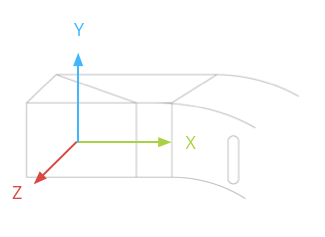

# Locations and Sensors

You access location and sensor data using the standard Android platform APIs.## Location

Location on Glass involves using the standard Android platform APIs to get location data from available location providers.

You'll use the following Android SDK classes to get location data:

-   [`LocationManager`](http://developer.android.com/reference/android/location/LocationManager.html) – Provides access to the Android location system service that handles communication with a [`LocationProvider`](http://developer.android.com/reference/android/location/LocationProvider.html).
-   [`LocationProvider`](http://developer.android.com/reference/android/location/LocationProvider.html) – Provides location data based on some criteria. Glass provides special "remote" providers that let you obtain location data from a paired device that has the MyGlass companion app installed.
-   [`Criteria`](http://developer.android.com/reference/android/location/Criteria.html) – Lets you create a set of criteria that selects the best [`LocationProvider`](http://developer.android.com/reference/android/location/LocationProvider.html) based on the criteria that you set.

### Overview

To obtain location data, you'll need to use the [`LocationManager`](http://developer.android.com/reference/android/location/LocationManager.html) class to get data from one or more location providers.

Applications on an Android phone or tablet retrieve location data from local GPS and network location providers on the device. On Glass, however, the set of available location providers is dynamic and may include _remote_ location providers that supply location data from another source, such as a Bluetooth-paired device with the MyGlass companion app installed. To handle these additional providers, listen for location updates from _multiple providers_ rather than a single provider.

> **Warning**: Do not use the [`LocationManager.getBestProvider()`](http://developer.android.com/reference/android/location/LocationManager.html#getBestProvider(android.location.Criteria,%20boolean)) method or the constants [`GPS_PROVIDER`](http://developer.android.com/reference/android/location/LocationManager.html#GPS_PROVIDER) or [`NETWORK_PROVIDER`](http://developer.android.com/reference/android/location/LocationManager.html#NETWORK_PROVIDER) to listen for location updates. Glass uses a dynamic set of providers and listening only to a single provider may cause your application to miss location updates.

To request data from all available location providers:

1.  Create a [`Criteria`](http://developer.android.com/reference/android/location/Criteria.html) object with your location requirements.
2.  Call [`getProviders()`](http://developer.android.com/reference/android/location/LocationManager.html#getProviders(android.location.Criteria,%20boolean)) to retrieve the list of enabled providers that satisfy your criteria.
3.  Iterate over the list of providers and request updates from all of them. This ensures that you receive updates from the remote providers if they are available but also from the local providers on Glass (such as a wireless network provider).
4.  Use the accuracy and timing information provided with each update to determine whether the update is good enough or if you should wait for another one.

```java
LocationManager locationManager; // initialized elsewhere

// This example requests fine accuracy and requires altitude, but
// these criteria could be whatever you want.
Criteria criteria = new Criteria();
criteria.setAccuracy(Criteria.ACCURACY_FINE);
criteria.setAltitudeRequired(true);

List<String> providers = locationManager.getProviders(
        criteria, true /* enabledOnly */);

for (String provider : providers) {
    locationManager.requestLocationUpdates(provider, minTime,
            minDistance, listener);
}
```

## Sensors

### Glass

Glass has a specialized sensor to detect whether or not the device is on the users' head. When enabled, this setting helps conserve battery when the device is not in use. You can use this feature in your Glassware to disable or throttle background services. Start by implementing a [`BroadcastReceiver`](https://developer.android.com/reference/android/content/BroadcastReceiver.html) to detect [`ACTION_ON_HEAD_STATE_CHANGE`](https://developers.google.com/glass/develop/gdk/reference/com/google/android/glass/content/Intents#ACTION_ON_HEAD_STATE_CHANGED) [**TODO**: ADD LINK] events.

> **Note**: Your app can not detect on-head detection events if the user disables the feature in the settings.

The following example delays and disables game score updates based on whether the user has removed Glass from their head:

1.  Implement a [`BroadcastReceiver`](https://developer.android.com/reference/android/content/BroadcastReceiver.html) to handle the state change.
2.  In your service, implement the [`onCreate()`](https://developer.android.com/reference/android/app/Service.html#onCreate()) method and register a receiver that listens for the [`ACTION_ON_HEAD_STATE_CHANGE`](https://developers.google.com/glass/develop/gdk/reference/com/google/android/glass/content/Intents#ACTION_ON_HEAD_STATE_CHANGED) [**TODO**: ADD LINK] intent.
3.  In the [`onDestroy()`](https://developer.android.com/reference/android/app/Service.html#onDestroy()) method, unregister the receiver.

```java
import com.google.android.glass.content.Intents;
...

public class LiveCardService extends Service {

    ...
    private boolean mIsStopped = false;

    private final BroadcastReceiver broadCastReceiver = new BroadcastReceiver() {
        @Override
        public void onReceive(Context context, Intent intent) {

            if (Intents.ACTION_ON_HEAD_STATE_CHANGED.equals(intent.getAction())) {
                boolean onHead = intent.getBooleanExtra(Intents.EXTRA_IS_ON_HEAD,
                        false);
                if (onHead) {
                    mDelay = LiveCardService.DELAY_MILLIS;
                    if (isStopped()) {
                        // Resume updating scores
                        setStop(false);

                        // Restart immediately to get a refreshed score
                        mHandler.postDelayed(mUpdateLiveCardRunnable, 0);
                    }
                } else {
                    // Increase the delay when the device is off head
                    mDelay = LiveCardService.DELAY_MILLIS_EXT;
                }
            }
        }
    };

    private final Runnable mUpdateLiveCardRunnable = new Runnable() {

        @Override
        public void run() {

            if (mDelay == DELAY_MILLIS_EXT) {
                // Count the increased delay as a retry attempt
                mRetryCount++;
            } else if (mDelay == DELAY_MILLIS) {
                mRetryCount = 0;
            }

            if (mRetryCount > MAX_RETRIES) {
                // Stop updating scores
                mIsStopped = true;
            }

            if (!isStopped()) {
                // Generate fake points.
                homeScore += mPointsGenerator.nextInt(3);
                awayScore += mPointsGenerator.nextInt(3);

                // Update the remote view with the new scores.
                mLiveCardView = getRemoteViews(homeScore, awayScore);

                // Always call setViews() to update the live card's RemoteViews.
                mLiveCard.setViews(mLiveCardView);

                // Queue another score update in 30 seconds.
                mHandler.postDelayed(mUpdateLiveCardRunnable, mDelay);
            }
        }
    };

    @Override
    public void onCreate() {
        super.onCreate();
        mPointsGenerator = new Random();
        mDelay = DELAY_MILLIS;

        registerReceiver(broadCastReceiver, new IntentFilter(
                Intents.ACTION_ON_HEAD_STATE_CHANGED));
    }

    @Override
    public int onStartCommand(Intent intent, int flags, int startId) {
        if (mLiveCard == null) {

            // Get an instance of a live card
            mLiveCard = new LiveCard(this, LIVE_CARD_TAG);

            // Inflate a layout into a remote view
            mLiveCardView = new RemoteViews(getPackageName(),
                    R.layout.live_card);

            // Set up initial RemoteViews values
            homeScore = 0;
            awayScore = 0;
            mLiveCardView = getRemoteViews(homeScore, awayScore);

            // Set up the live card's action with a pending intent
            // to show a menu when tapped
            Intent menuIntent = new Intent(this, LiveCardMenuActivity.class);
            menuIntent.addFlags(Intent.FLAG_ACTIVITY_NEW_TASK |
                    Intent.FLAG_ACTIVITY_CLEAR_TASK);
            mLiveCard.setAction(PendingIntent.getActivity(
                    this, 0, menuIntent, 0));

            // Publish the live card
            mLiveCard.publish(PublishMode.REVEAL);

            // Queue the update text runnable
            mHandler.post(mUpdateLiveCardRunnable);
        }

        return START_STICKY;
    }

    @Override
    public void onDestroy() {
        if (mLiveCard != null && mLiveCard.isPublished()) {
            //Stop the handler from queuing more Runnable jobs
            setStop(true);

            mLiveCard.unpublish();
            mLiveCard = null;
        }

        unregisterReceiver(broadCastReceiver);

        super.onDestroy();
    }

    @Override
    public IBinder onBind(Intent intent) {
        return null;
    }

    private RemoteViews getRemoteViews(int homeScore, int awayScore) {
        RemoteViews remoteViews = new RemoteViews(getPackageName(),
                R.layout.live_card);

        remoteViews.setTextViewText(R.id.home_team_name_text_view,
                getString(R.string.home_team));
        remoteViews.setTextViewText(R.id.away_team_name_text_view,
                getString(R.string.away_team));
        remoteViews.setTextViewText(R.id.footer_text,
                getString(R.string.game_quarter));

        remoteViews.setTextViewText(R.id.home_score_text_view,
                String.valueOf(homeScore));
        remoteViews.setTextViewText(R.id.away_score_text_view,
                String.valueOf(awayScore));
        return remoteViews;
    }

    public boolean isStopped() {
        return mIsStopped;
    }

    public void setStop(boolean isStopped) {
        mIsStopped = isStopped;
    }
}
```

### Android

The following Android sensors are supported on Glass:

-   [`TYPE_ACCELEROMETER`](http://developer.android.com/reference/android/hardware/Sensor.html#TYPE_ACCELEROMETER)
-   [`TYPE_GRAVITY`](http://developer.android.com/reference/android/hardware/Sensor.html#TYPE_GRAVITY)
-   [`TYPE_GYROSCOPE`](http://developer.android.com/reference/android/hardware/Sensor.html#TYPE_GYROSCOPE)
-   [`TYPE_LIGHT`](http://developer.android.com/reference/android/hardware/Sensor.html#TYPE_LIGHT)
-   [`TYPE_LINEAR_ACCELERATION`](http://developer.android.com/reference/android/hardware/Sensor.html#TYPE_LINEAR_ACCELERATION)
-   [`TYPE_MAGNETIC_FIELD`](http://developer.android.com/reference/android/hardware/Sensor.html#TYPE_MAGNETIC_FIELD)
-   [`TYPE_ORIENTATION`](http://developer.android.com/reference/android/hardware/Sensor.html#TYPE_ORIENTATION) (deprecated)
-   [`TYPE_ROTATION_VECTOR`](http://developer.android.com/reference/android/hardware/Sensor.html#TYPE_ROTATION_VECTOR)

The following Android sensors are not supported:

-   [`TYPE_AMBIENT_TEMPERATURE`](http://developer.android.com/reference/android/hardware/Sensor.html#TYPE_AMBIENT_TEMPERATURE)
-   [`TYPE_PRESSURE`](http://developer.android.com/reference/android/hardware/Sensor.html#TYPE_PRESSURE)
-   [`TYPE_PROXIMITY`](http://developer.android.com/reference/android/hardware/Sensor.html#TYPE_PROXIMITY)
-   [`TYPE_RELATIVE_HUMIDITY`](http://developer.android.com/reference/android/hardware/Sensor.html#TYPE_RELATIVE_HUMIDITY)
-   [`TYPE_TEMPERATURE`](http://developer.android.com/reference/android/hardware/Sensor.html#TYPE_TEMPERATURE)

> **Note**: The Glass platform is based on Android 4.4 (API Level 19), but does not support the sensor features of that platform level or Android 4.3 (API Level 18). API features for sensors is frozen at Android 4.2 (API Level 17) for the aforementioned sensors that are supported.

Here are some tips when using sensors on Glass:

-   The Glass sensor coordinate system is shown below relative to the Glass display. For more information, see [sensor coordinate system](http://developer.android.com/guide/topics/sensors/sensors_overview.html#sensors-coords).



-   The accelerometer, gyroscope, and magnetometer are located on the optics pod of the Glass device, which users rotate to align the device with their sight. You cannot measure the angle of the optics pod directly, so be aware of this when using angles from these sensors for applications such as compass heading.
-   To preserve battery life, only listen to sensors when you need them. For example, if your Glassware uses a [`Service`](http://developer.android.com/reference/android/app/Service.html) to render a [`LiveCard`](https://developers.google.com/glass/develop/gdk/reference/com/google/android/glass/timeline/LiveCard) [**TODO**: ADD LINK] and you only need the sensors when the live card is visible, use the [`LiveCard`](https://developers.google.com/glass/develop/gdk/reference/com/google/android/glass/timeline/LiveCard) [**TODO**: ADD LINK] surface callback methods to start and stop listening to the sensors.
-   Sensor event callbacks run on the UI thread, so process events and return as quickly as possible. Consider pushing sensor events into a queue and using a background thread to handle them if your processing takes too long.
-   50 Hz is often a sufficient sampling rate for tracking head motion.

For more information on how to use sensors, see the [Android developer guide](http://developer.android.com/guide/topics/sensors/sensors_overview.html).

---

Portions of this page are reproduced from work created and [shared by Google](https://developers.google.com/readme/policies) and used according to terms described in the [Creative Commons 4.0 Attribution License](https://creativecommons.org/licenses/by/4.0/).
