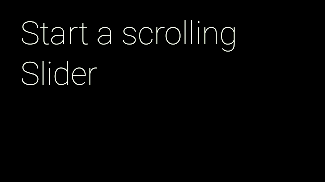
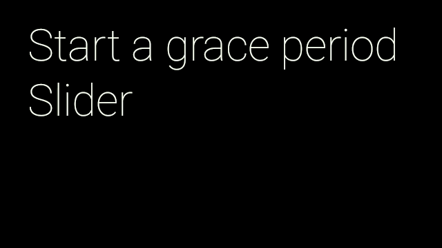
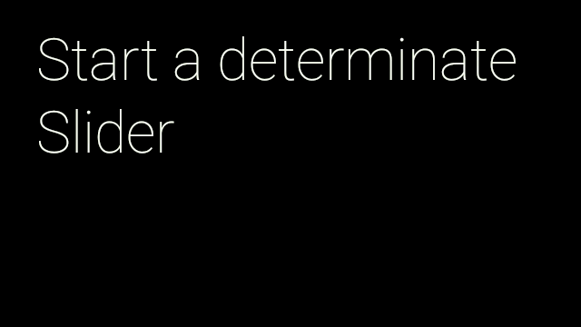

# Slider

You can use sliders to show a loading, progress, or navigation bar on the bottom of the screen. Sliders are global UX components and should be treated with care when implementing them in your Glassware.

> **Important**: 
> 
> - Sliders are shared between different activities in Glass. For example, if you launch a slider in your activity, and the user pauses your activity to start a new activity that launches its own slider, when your activity resumes, your slider is not continued. If you want your slider to appear again, you must handle this scenario.
> 
> - Slider requests must be associated with a view and those requests are only honored when the window containing that view has focus. If another window comes into focus on Glass, the system hides the slider.

## Scroller Slider



Scroller sliders are used to indicate the position of a card as you swipe through multiple cards. You can create the same type of effect using [`Slider.Scroller`](https://developers.google.com/glass/develop/gdk/reference/com/google/android/glass/widget/Slider.Scroller) [**TODO**: ADD LINK].

1.  Use [`Slider.from()`](https://developers.google.com/glass/develop/gdk/reference/com/google/android/glass/widget/Slider#from(android.view.View)) [**TODO**: ADD LINK] to create a [`Slider`](https://developers.google.com/glass/develop/gdk/reference/com/google/android/glass/widget/Slider) [**TODO**: ADD LINK] that uses a [`View`](https://developer.android.com/reference/android/view/View.html) to display the slider.
2.  Create the [`Slider.Scroller`](https://developers.google.com/glass/develop/gdk/reference/com/google/android/glass/widget/Slider.Scroller) [**TODO**: ADD LINK] using [`startScroller()`](https://developers.google.com/glass/develop/gdk/reference/com/google/android/glass/widget/Slider#startScroller(int,%20float)) [**TODO**: ADD LINK] and set the max and initial positions.

Here's a simple implementation that animates a scroller to the next position when the user taps:

```java
public final class SliderActivity extends Activity {

    private static final int MAX_SLIDER_VALUE = 5;
    private static final long ANIMATION_DURATION_MILLIS = 5000;

    private CardScrollView mCardScroller;
    private Slider mSlider;

    @Override
    protected void onCreate(Bundle bundle) {
        super.onCreate(bundle);

        // Create the cards for the view
        mCardScroller = new CardScrollView(this);
        mCardScroller.setAdapter(new CardAdapter(createCards()));

        // Set the view for the Slider
        mSlider = Slider.from(mCardScroller);

        mCardScroller.setOnItemClickListener(new AdapterView.OnItemClickListener() {
            @Override
            public void onItemClick(AdapterView<?> parent, View view,
                    int position, long id) {
                processSliderRequest(position+1);
            }
        });

        setContentView(mCardScroller);
    }

    private void processSliderRequest(position) {
        Slider.Scroller scroller = mSlider.startScroller(MAX_SLIDER_VALUE, 0);

        // Animate the slider to the next position. The slider
        // automatically hides after the duration has elapsed
        ObjectAnimator.ofFloat(scroller, "position", 0, position)
            .setDuration(ANIMATION_DURATION_MILLIS)
            .start();
    }
}
```

## Grace Period Slider



Grace period sliders work in activities where it is useful for a user to see a notification, but user interaction is not required. You can add this animation by using [`Slider.GracePeriod`](https://developers.google.com/glass/develop/gdk/reference/com/google/android/glass/widget/Slider.GracePeriod) [**TODO**: ADD LINK].

1.  Use [`Slider.from()`](https://developers.google.com/glass/develop/gdk/reference/com/google/android/glass/widget/Slider#from(android.view.View)) [**TODO**: ADD LINK] to create a [`Slider`](https://developers.google.com/glass/develop/gdk/reference/com/google/android/glass/widget/Slider) [**TODO**: ADD LINK] that uses a [`View`](https://developer.android.com/reference/android/view/View.html) to display the slider.
2.  Create a [`GracePeriod.Listener`](https://developers.google.com/glass/develop/gdk/reference/com/google/android/glass/widget/Slider.GracePeriod.Listener) [**TODO**: ADD LINK] and implement the [`onGracePeriodEnd()`](https://developers.google.com/glass/develop/gdk/reference/com/google/android/glass/widget/Slider.GracePeriod.Listener#onGracePeriodEnd()) [**TODO**: ADD LINK] and [`onGracePeriodCancel()`](https://developers.google.com/glass/develop/gdk/reference/com/google/android/glass/widget/Slider.GracePeriod.Listener#onGracePeriodCancel()) [**TODO**: ADD LINK] to handle those events.
3.  Create a [`Slider.GracePeriod`](https://developers.google.com/glass/develop/gdk/reference/com/google/android/glass/widget/Slider.GracePeriod) [**TODO**: ADD LINK] and start the animation by passing in the [`GracePeriod.Listener`](https://developers.google.com/glass/develop/gdk/reference/com/google/android/glass/widget/Slider.GracePeriod.Listener) [**TODO**: ADD LINK] to the [`startGracePeriod()`](https://developers.google.com/glass/develop/gdk/reference/com/google/android/glass/widget/Slider#startGracePeriod(com.google.android.glass.widget.Slider.GracePeriod.Listener)) [**TODO**: ADD LINK] method.
4.  Override the activity's [`onBackPressed()`](https://developer.android.com/reference/android/app/Activity.html#onBackPressed()) to handle the swipe down gesture.
5.  If the user swipes down, call [`cancel()`](https://developers.google.com/glass/develop/gdk/reference/com/google/android/glass/widget/Slider.GracePeriod#cancel()) [**TODO**: ADD LINK] on the [`Slider.GracePeriod`](https://developers.google.com/glass/develop/gdk/reference/com/google/android/glass/widget/Slider.GracePeriod) [**TODO**: ADD LINK] to dismiss the slider.

In the following example, the grace period scroller is initiated with a listener that plays a success sound when the period ends and a dismissed sound if the grace period slider is cancelled:

```java
public final class SliderActivity extends Activity {

    ...
    private Slider.GracePeriod mGracePeriod;

    private final GracePeriod.Listener mGracePeriodListener =
        new GracePeriod.Listener() {

        @Override
        public void onGracePeriodEnd() {
            // Play a SUCCESS sound to indicate the end of the grace period.
            AudioManager am = (AudioManager) getSystemService(Context.AUDIO_SERVICE);
            am.playSoundEffect(Sounds.SUCCESS);
            mGracePeriod = null;
        }

        @Override
        public void onGracePeriodCancel() {
            // Play a DIMISS sound to indicate the cancellation of the grace period.
            AudioManager am = (AudioManager) getSystemService(Context.AUDIO_SERVICE);
            am.playSoundEffect(Sounds.DISMISSED);
            mGracePeriod = null;
        }
    };

    @Override
    protected void onCreate(Bundle bundle) {
        super.onCreate(bundle);

        // Create the cards for the view
        mCardScroller = new CardScrollView(this);
        mCardScroller.setAdapter(new CardAdapter(createCards()));

        // Set the view for the Slider
        mSlider = Slider.from(mCardScroller);

        mCardScroller.setOnItemClickListener(new AdapterView.OnItemClickListener() {
            @Override
            public void onItemClick(AdapterView<?> parent, View view,
                    int position, long id) {
                mGracePeriod = mSlider.startGracePeriod(mGracePeriodListener);
            }
        });

        setContentView(mCardScroller);
    }

    @Override
    public void onBackPressed() {
        // If the Grace Period is running,
        // cancel it instead of finishing the Activity.
        if (mGracePeriod != null) {
            mGracePeriod.cancel();
        } else {
            super.onBackPressed();
        }
    }
}
```

## Determinate Slider



Determinate sliders are mainly used to show progress where you can calculate when a task finishes. You can add this animation by using [`Slider.Determinate`](https://developers.google.com/glass/develop/gdk/reference/com/google/android/glass/widget/Slider.Determinate) [**TODO**: ADD LINK].

1.  Use [`Slider.from()`](https://developers.google.com/glass/develop/gdk/reference/com/google/android/glass/widget/Slider#from(android.view.View)) [**TODO**: ADD LINK] to create a [`Slider`](https://developers.google.com/glass/develop/gdk/reference/com/google/android/glass/widget/Slider) [**TODO**: ADD LINK] that uses a [`View`](https://developer.android.com/reference/android/view/View.html) to display the slider.
2.  Create the [`Slider.Determinate`](https://developers.google.com/glass/develop/gdk/reference/com/google/android/glass/widget/Slider.Determinate) [**TODO**: ADD LINK] using [`startScroller()`](https://developers.google.com/glass/develop/gdk/reference/com/google/android/glass/widget/Slider#startDeterminate(int,%20float)) [**TODO**: ADD LINK] and set the max and initial positions.
3.  When the animation finishes, call the [`hide()`](https://developers.google.com/glass/develop/gdk/reference/com/google/android/glass/widget/Slider.Determinate#hide()) [**TODO**: ADD LINK] method on the [`Slider.Determinate`](https://developers.google.com/glass/develop/gdk/reference/com/google/android/glass/widget/Slider.Determinate) [**TODO**: ADD LINK] to hide the slider.

Here's a simple implementation that animates the scroller to a set position when the user taps:

```java
public final class SliderActivity extends Activity {

    ...
    private Slider.Determinate mDeterminate;

    @Override
    protected void onCreate(Bundle bundle) {
        super.onCreate(bundle);

        // Create the cards for the view
        mCardScroller = new CardScrollView(this);
        mCardScroller.setAdapter(new CardAdapter(createCards()));

        // Set the view for the Slider
        mSlider = Slider.from(mCardScroller);

        mCardScroller.setOnItemClickListener(new AdapterView.OnItemClickListener() {
            @Override
            public void onItemClick(AdapterView<?> parent, View view,
                   int position, long id) {
                mDeterminate = mSlider.startDeterminate(MAX_SLIDER_VALUE, 0);
                ObjectAnimator animator = ObjectAnimator.ofFloat(mDeterminate,
                    "position", 0, MAX_SLIDER_VALUE);

                // Hide the slider when the animation stops.
                animator.addListener(new AnimatorListenerAdapter() {
                    @Override
                    public void onAnimationEnd(Animator animation) {
                        mDeterminate.hide();
                    }
                });

                // Start an animation showing the different positions of the slider.
                animator.setDuration(ANIMATION_DURATION_MILLIS).start();
            }
        });

        setContentView(mCardScroller);
    }
}
```

## Indeterminate Slider


Indeterminate sliders can be used for loading screens where it is difficult to calculate when the task finishes. You can add this animation by using [`Slider.Indeterminate`](https://developers.google.com/glass/develop/gdk/reference/com/google/android/glass/widget/Slider.Indeterminate) [**TODO**: ADD LINK].

1.  Use [`Slider.from()`](https://developers.google.com/glass/develop/gdk/reference/com/google/android/glass/widget/Slider#from(android.view.View)) [**TODO**: ADD LINK] to create a [`Slider`](https://developers.google.com/glass/develop/gdk/reference/com/google/android/glass/widget/Slider) [**TODO**: ADD LINK] that uses a [`View`](https://developer.android.com/reference/android/view/View.html) to display the slider.
2.  Start the animation with the [`Slider.startIndeterminate()`](https://developers.google.com/glass/develop/gdk/reference/com/google/android/glass/widget/Slider#startIndeterminate()) [**TODO**: ADD LINK] method.
3.  When you are ready to stop the animation, call the [`hide()`](https://developers.google.com/glass/develop/gdk/reference/com/google/android/glass/widget/Slider.Indeterminate#hide()) [**TODO**: ADD LINK] method on the [`Slider.Indeterminate`](https://developers.google.com/glass/develop/gdk/reference/com/google/android/glass/widget/Slider.Indeterminate) [**TODO**: ADD LINK].

Here's a simple implementation that creates the indeterminate scroller when the user taps the card and hides it when the user taps again:

```java
public final class SliderActivity extends Activity {

    ...
    private Slider.Indeterminate mIndeterminate;

    @Override
    protected void onCreate(Bundle bundle) {
        super.onCreate(bundle);

        // Create the cards for the view
        mCardScroller = new CardScrollView(this);
        mCardScroller.setAdapter(new CardAdapter(createCards()));

        // Set the view for the Slider
        mSlider = Slider.from(mCardScroller);

        mCardScroller.setOnItemClickListener(new AdapterView.OnItemClickListener() {
            @Override
            public void onItemClick(AdapterView<?> parent, View view,
                   int position, long id) {
                // Toggle between showing/hiding the indeterminate slider.
                if (mIndeterminate != null) {
                    mIndeterminate.hide();
                    mIndeterminate = null;
                } else {
                    mIndeterminate = mSlider.startIndeterminate();
                }
        });

        setContentView(mCardScroller);
    }
}
```

---

Portions of this page are reproduced from work created and [shared by Google](https://developers.google.com/readme/policies) and used according to terms described in the [Creative Commons 4.0 Attribution License](https://creativecommons.org/licenses/by/4.0/).