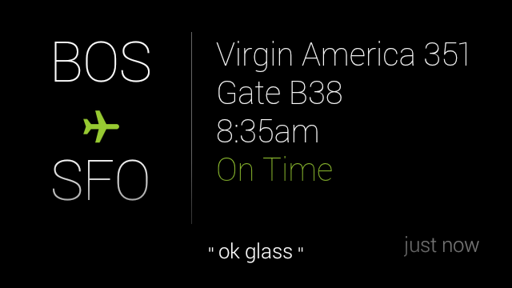

# Best Practices

This document goes over some best practices for design and information delivery. Follow these guidelines when applicable to ensure the best user experience.

## Design first, code second

Learn the design principles and patterns before you start to develop on Glass. For more information, read the [Design](../design/index.md) guides.

To get early design feedback, create and submit your Glassware Flow design to the review team.

> **Editor's note**: Glassware Flow Designer is out of commission.

## Don't use a pinned timeline item as a launcher

The two main ways for users to invoke Glassware and its features are by using a voice or touch command from the **ok glass** main menu or through a contextual menu from a timeline card.

You should never force users to pin a timeline card with menu items for the purpose launching Glassware. The Mirror API is designed for [periodic notifications](../design/patterns#periodic_notifications) based on user-configured settings.

Providing menu items to launch GDK Glassware or call the Mirror API is okay as long as the experience is consistent with the [periodic notifications](../design/patterns#periodic_notifications) design pattern and does not use the [Mirror API for immediate interactivity](#dont_use_the_mirror_api_for_immediate_interactivity).

For example, a pet adoption Glassware shouldn't insert a timeline card and force users to pin it to access features later on (for example, to "Search for dogs", "Search for cats", "Search for birds", and so on). Instead, the Glassware should allow users to set criteria for the pets they want and periodically deliver cards that meet this criteria. These cards can then contain menu items to carry out actions such as "Read bio" and "Adopt pet".

## Follow standard card design and templates

When possible, use approved [card designs](../develop/gdk/card-design#layouts) and templates. If the templates do not work:

> **Editor's note**: the templates do not work.

-   Use the styles in [base_style.css](../design/static/base_style.css) if you are using the Mirror API.
-   Follow the [general rules](../design/style#card_regions) for padding and spacing as the built-in templates.

## Follow media requirements

If delivering media, follow these guidelines:

-   All public videos are streamed and not attached to timeline items.
-   Video aspect ratio is 16:9.
-   Video resolution is 640 × 360 pixels.
-   H.264 format

## Bundle and paginate properly

Bundles and pagination allow you to group together cards, but you should use them correctly in the following situations.

### Bundles

-   Use bundles for groups of cards that are similar but shouldn't be on the same card.
-   Design bundle cover cards to be digests that are visually different from the cards the bundle contains.
-   Notify the user with a notification sound only once for each bundle.

Cases where bundles work well:

-   A thread of emails or short messages
-   Three SMS messages between the same people
-   Five photos taken within an hour of each other
-   Related articles inserted all at once
-   A list of key events and score updates for an ongoing sports game

Cases where bundles don't work well:

-   All content from your service
-   Many headlines sent to Glass over the course of a day

### Pagination

Use pagination for timeline items that do not fit on a single card because of space constraints, but otherwise should be on the same card.

Cases where pagination work well:

-   A single email, news story, or similar content that doesn't fit on one card

Cases where pagination doesn't work well:

-   A group of distinct cards, such as multiple news stories or emails

## Follow standard menu design

### Custom menu items

-   Each menu item action must have an associated 50 × 50 icon. Use the [Glass menu icons](../menu_icons.zip) to stay consistent with the Glass UI.
-   Limit display names to a few words if possible. Use an imperative verb with or without an object.
-   Use the default icon and display name for built-in menu items unless you are using the menu item for something very different.
-   Icons are completely white in color and on transparent backgrounds.
-   Use short and actionable menu item display names. Imperative verbs with or without objects work great, like in the following examples.
-   "Dismiss" menu items remove the timeline card from the timeline only, so create a custom menu item for this only if you require it. In general, you should let timeline items decay naturally over time and not require users to actively manage your app.
-   Keep names to 15 characters or less. For example:

| Bad | Good |
| --- | ---- |
| Extend recording | Extend video |
| Send a message to Joe | Send message |

### Built-in menu items

-   Reply or Reply All - Voice replies are intended to capture free-form input by voice. Do not use voice replies to capture a limited set of options, such as possible moves in a game.
    
-   Delete - Dismisses the timeline card and deletes the content that corresponds to the timeline card everywhere it is stored (local and server storage). Do not confuse your users by offering a "Delete" menu item if the functionality you offer is a "Dismiss".

## Don't use the Mirror API for immediate interactivity

The Mirror API is not designed to receive requests from users and respond in real-time or with low latency. If this is a requirement, use the GDK.

For example, Mirror API Glassware works well with the "take a note" command, because users do not have to wait for a response from the Glassware after invoking the command.

In contrast, "find a recipe, spaghetti" does not work well with Mirror API Glassware, because users expect search results to display immediately. With the Mirror API, users have to wait a while for a card to be inserted to the timeline to continue using the Glassware, which is not a good user experience.

This constraint applies to main voice commands on the Glass Home card as well as menu items on cards and immersions.

## Create content appropriately

When creating content for your cards, each card needs to be concise and contain one logical piece of information. In addition:

-   Use imagery instead of text when possible
-   Display images in their original aspect ratio (cropped is okay).
-   Keep the middle area of a card's footer blank. The **ok glass** contextual voice menu appears here and blocks any content beneath it.
-   If desired, use the `auto-resize` CSS class to automatically resize font sizes based on your content.
-   Follow our [writing guidelines](../design/style.md).

---

Portions of this page are reproduced from work created and [shared by Google](https://developers.google.com/readme/policies) and used according to terms described in the [Creative Commons 4.0 Attribution License](https://creativecommons.org/licenses/by/4.0/).
