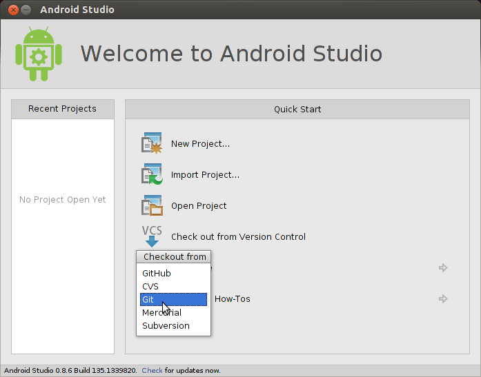

# GDK Quick Start

Before you begin to use the GDK, you need intermediate or better knowledge in Android development.

This quick start gets your environment set up with the GDK and shows you how to install your first piece of Glassware. Check out the [pattern guides](../patterns/index.md) for detailed information on how to build Glassware.

## For Android experts

If you're comfortable with Android, here's all you need to know:

1.  Get the **Android 4.4.2 (API 19) SDK** and **Glass Development Kit Preview** add-on from the Android SDK Manager.
2.  On Glass, turn on USB debugging (**Settings > Device Info > Turn on debug**).
3.  Import some [GDK samples](#importing_samples).
4.  When you're ready to create a project for your own Glassware, use these settings:
    -   **Compile with: Glass Development Kit Developer Preview**
    -   **Theme: None** (ADT and Android Studio usually assign a theme automatically, even if you specify no theme, so remove the `android:theme` property from your manifest after creating a project.)
5.  Head on over to the [pattern guides](../patterns/index.md) and [developer guides](./index.md) for more learning.

## For Android beginners

We recommend starting with the [Building Your First App](https://developer.android.com/training/basics/firstapp/index.html) training class at the [Android developers site](https://developer.android.com/) and then building a few simple Android apps before building GDK Glassware.

### Setting up the development environment

1.  We recommend installing [Android Studio](https://developer.android.com/sdk/installing/studio.html) for easier development. The rest of these steps assume you have this installed.
2.  Click **Configure > SDK Manager**.
3.  Install the **SDK Platform** and **Glass Development Kit Preview** for **Android 4.4.2 (API 19)**. Everything else is optional.
4.  On Glass, go to **Settings > Device Info > Turn on debug** to enable `adb`, which allows your development system to communicate with Glass.
5.  Connect Glass to your development system and tap on the touchpad to authorize debug access.

### Importing samples

To help get you started, GDK sample projects are available on our [GitHub](https://github.com/googleglass)  [**TODO**: Switch link] repository:

-   [ApiDemo](https://github.com/googleglass/gdk-apidemo-sample) [**TODO**: SWITCH LINK]: Gallery of some GDK APIs usage.
-   [Compass](https://github.com/glasskit/compass): Simple compass using a `LiveCard`.
-   [Stopwatch](https://github.com/googleglass/gdk-stopwatch-sample) [**TODO**: SWITCH LINK]: Simple stopwatch using a `LiveCard`.
-   [Timer](https://github.com/googleglass/gdk-timer-sample) [**TODO**: SWITCH LINK)]: Simple timer using a combination of `Immersion` and `LiveCard`.

To import one of the samples into Android Studio:

1.  Click **Check out from Version Control > Git**.

2. Use one of the samples' clone URL in the **Vcs Repository URL** field (example: `https://github.com/googleglass/gdk-apidemo-sample.git`) [**TODO**: SWITCH LINK].
3. Click **OK** on the following two screens.
4. Build the project and run it on your connected Glass by clicking on the **Play** button. Make sure to check the sample's `README` for invocation details.

