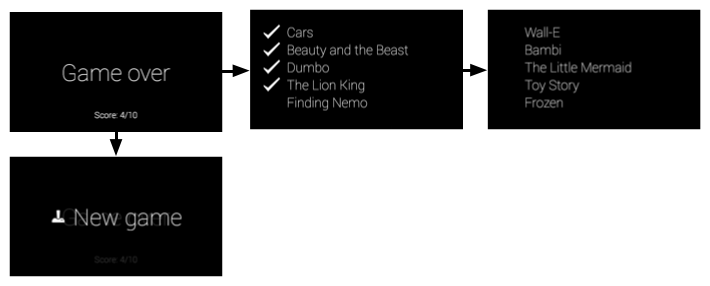

# Immersion Pattern

This guide describes the components that comprise a simple immersion experience, in the form of a Charades game. Games are a perfect use-case for immersions because most require a custom UI and input controls.

Along the way, you'll also learn design, development, and distribution tips that are important to building your own Glassware.

## Before you begin

The full source of the Charades game is available on Github. Import it into Android Studio before you begin, because this guide refers to it heavily.

1.  From the Quick Start screen click **Check out from version Control > Git**.
2.  Copy the clone URL from [Charades](https://github.com/googleglass/gdk-charades-sample) [**TODO**: SWITCH LINK].
3.  Paste the clone URL into the **Vcs Repository URL** and click **Clone**.
4.  Click **Yes** on the following screen.
5.  Click **OK** on the following screen.
6.  Build the project and run it on your connected Glass by clicking on the **Play** button. Make sure to check the sample's `README` for invocation details.

## What you'll learn

You'll learn how to use components from the Android SDK to build the bulk of the Charades immersion and then the GDK to hook into the Glass experience. Here's a list of topics that you'll learn about:

-   Designing the flow of the UI with the design resources we provide
-   Designing voice triggers to start Glassware
-   Using Android activities to define the game's UI structure
-   Building Android menu items that let users select game options
-   Integrating into the Glass experience with a voice trigger on the main menu
-   Using GDK gesture detectors that detect user input and carry out custom actions
-   Learning simple Android UI implementations that add extra polish and follow Glass style
-   Learning about the distribution process and what we look for when releasing Glassware

## Design

Before you start developing, take some time and design your Glassware. Doing this gives you a good idea of what UI flows work best on Glass, what voice command you'll use, and how your cards will look.

Of course, designing Glassware is an iterative process and some of the things that you design now will change, but having a good portion of this work done in the beginning is crucial to building a great experience.

### UI flow

Designing the UI flow is a simple exercise and lets you visualize your Glassware before writing a line of code. We do it all the time for the Glassware that we build!

Let's go over the major UI elements of the Charades immersion, so you get an idea of how the UI works and how helpful this process can be when creating your own Glassware.

#### Splash screen

This screen is the first one users see when they start the Charades immersion. It allows users to orient themselves before having to jump into the gaming experience and is a general gaming construct that users are familiar with.

When users tap on the touchpad, a menu system with two items appears, **New Game** and **Instructions**.

#### Instructions mode

When creating immersions, input mechanisms are sometimes novel, so it's useful to let users know how they should interact with the immersion, especially with a game.

This set of cards shows the instructions for the game and guides users on how to play and what gestures to use to navigate through the UI. Users get to it by tapping on the **Instructions** menu item from the splash screen.

#### Gameplay mode

These screens comprise the main gameplay flow. Users can get to this flow by tapping on the **New game** menu item from the splash screen.

This set of cards shows a random word (up to 10). Users skip a word by swiping forward and tap the touchpad when they correctly describe the word.

#### Game results screen

This screen shows the results of the game. The "Game over" screen initially appears and users can swipe forward to see the game results. When users tap on any of the results cards, the **New Game** menu item appears to let users start another game.

### Voice command

You should figure out a voice command fairly early in the design process. Voice commands let users start Glassware from the Glass Home (clock card) voice menu, if needed, and is a major part of how you design Glassware.

For example, the **Post an update** command works well in a fire-and-forget model, where users speak the command and some text and the Glassware processes it without any further user intervention. This lets users get back to what they're doing quickly.

On the other hand, for something like **Play a game**, you'll usually want to land users on a splash screen so that they can get oriented first. Because this voice command most likely launches an immersion, you can expect users to be okay with seeing extra screens and menus to start the game. Immediately throwing users into a gaming experience right after the voice command is typically a bad experience for games.

Charades uses the **Play a game** voice command . After users invoke the voice command, the Charades splash screen appears, prompting users to **Tap for more options** (**New game** or **Instructions** in this case).

> **Note:** Glass automatically adds a touch command to the main menu if users choose to tap instead of speak the voice command.

### Card layouts

Whether you're building immersions or live cards, you should use the [`CardBuilder`](https://developers.google.com/glass/develop/gdk/card-design#glass-styled_cards) [**TODO**: SWITCH LINK] or [XML layouts](https://developers.google.com/glass/develop/gdk/card-design#xml_layouts) [**TODO**: SWITCH LINK] when possible.

Oftentimes, you'll still need to build your own layout so follow our [UI guidelines](../../design/style#metrics_and_grids) to have the best looking Glassware.

The Stopwatch follows the general layout guidelines, but has custom UI layouts using standard Android components like views and layouts.

> **Designing Tip**:
> 
> The Mirror API Playground (not available) is a useful tool for mocking GDK cards. You can use one of the templates as a starting point, edit the HTML for the card, and see changes in real time.
> 
> You can then use the mock as a reference to create your custom XML layouts in Android.

## Develop

To develop immersions, you use the same tools you'd use for Android development to build the bulk of the Glassware and then use the APIs in the GDK add-on to access Glass-specific functionality, such as gesture detectors and voice commands.

You'll frequently use common Android components to create Glassware, but keep in mind that some concepts are sometimes different. For example, do not equate an immersion with an Android activity. Immersions are experiences designed for Glass that are built with one or many Android activities, as well as many other components of the GDK and Android SDK.

The rest of the Develop sections go over how the Charades game is structured and the major components of the project that you imported earlier. It's useful to have Android Studio up now so that you can follow along. The source code itself is commented, so this section goes over the high-level purpose of each file and helpful tips that you can apply to your own Glassware.

Here's a brief overview of the major components of Charades:

-   Voice trigger declaration to hook into the Glass main voice menu.
-   Splash screen activity to allow users to start a game or see instructions. This activity launches the instructions activity or the gameplay activity
-   The tutorial activity shows users how to play the game by actually carrying out the game's main actions
-   The gameplay activity lets users play the actual game
-   The results activity shows the score of the game and a list of guessed and unguessed words. It also lets users start a new game with a menu item.

> **Development Tip**:
> 
> A benefit of designing your UI flow is that they naturally help you structure your actual development. Each major flow that we went over before translates to a single activity of the immersion.

### Voice command

You create voice commands with an XML resource file that specifies the command you're using and then by specifying the XML resource in the `AndroidManifest.xml` file.

The following files are associated with the Charades voice command:

-   `res/xml/voice_trigger_play_a_game .xml` - Declares the voice command to use.
-   `AndroidManifest.xml` - Declares the activity to start when the voice command is spoken.

> **Development Tip**: 
> 
> Check out the list of [existing commands](https://developers.google.com/glass/develop/gdk/reference/com/google/android/glass/app/VoiceTriggers.Command) [**TODO**: ADD LINK].
> 
> For development purposes, you can declare any voice command you want by using [voice development mode](https://developers.google.com/glass/develop/gdk/starting-glassware#unlisted_commands) [**TODO**: ADD LINK].

### Splash screen activity

The splash screen is the first thing users see when starting Charades and orients them before starting the game.

The following files are associated with this activity:

-   `res/layout/activity_start_game.xml` - Declares the layout for the splash screen.
-   `res/menu/start_game.xml` - Declares the menu system for the splash screen, which contains **Instructions** and **New game** menu items.
-   `res/values/dimens.xml` - Declares standard card dimensions and padding that this project's activities use to follow Glass style.
-   `src/com/google/android/glass/sample/charades/StartGameActivity.java` - The main class for the splash screen.
-   `res/drawable-hdpi/ic_game_50.png` - The menu icon for **New game**.
-   `res/drawable-hdpi/ic_help_50.png` - The menu icon for **Instructions**.

### Game model

It's always a good idea to separate a game's model (the state of the game) from the UI. The `CharadesModel` class tracks the game's score and how many phrases have been guessed in the gameplay mode and the various instructions and whether or not users have gone through them in the instructions mode.

The following files are associated with the game model:

-   `src/com/google/android/glass/sample/charades/CharadesModel.java`

### Base game activity

Because the tutorial and gameplay modes of the game share very similar functionality and UIs, this base class defines the common functionality for both. The activities for the instructions and gameplay modes extend this class.

The following files are associated with this activity:

-   `res/layout/activity_game_play.xml` - Defines the layout that is shared by the gameplay and instructions modes of Charades.
-   `src/com/google/android/glass/sample/charades/BaseGameActivity.java` - Defines the base functionality of the gameplay and instructions modes of Charades, which is shared.

### Instructions activity

The instructions activity shows three cards that explain how to play the game. It detects whether or not users carry out the action displayed on the card before they can continue.

The following files are associated with this activity:

-   `src/com/google/android/glass/sample/charades/TutorialActivity.java` - Extends `BaseGameActivity` and defines what instruction text to show and how to handle gestures as users go through the instructions for the game.

### Gameplay activity

The gameplay activity defines the main flow of the game. It figures out what words to show, how to keep score, has a gesture detector to handle gestures, and launches the results activity when the game is over.

The following files are associated with this activity:

-   `GamePlayActivity` - Extends `BaseGameActivity` and contains the main gameflow logic.

### The results activity

The result activity shows the guessed words, unguessed words, and the score for the game. It also contains a menu item that lets users start a new game.

The following files are associated with this activity:

-   `res/layout/game_results.xml` - Defines the layout for the "Game over" card
-   `res/layout/card_results_summary.xml` - Defines the layout for showing the guessed and unguessed words in a list.
-   `res/layout/table_row_result.xml` - Defines an individual row layout for the results summary.
-   `src/com/google/android/glass/sample/charades/GameResultsActivity.java` - Defines the actual activity that shows the layouts and menus defined by the aforementioned XML resources.
-   `res/raw/sad_trombone.ogg` - The sound to play when users don't get through all the words.
-   `res/raw/triumph.ogg` - The sound to play when users get through all 10 words.
-   `res/drawable-hdpi/ic_done_50.png` - The checkmark icon that appears by words that are correctly guessed.

### Animation resources

These animation resources add extra polish to Charades:

-   `res/anim/slide_out_left.xml` - This animates an exiting view to slide out to the left (for instance, when a word is passed).
-   `res/anim/slide_in_right.xml` - This animates an entering view to slide in from the right (for instance, when a new word enters into view).
-   `res/anim/tug_right.xml` - This defines a tugging animation if you swipe on a view that doesn't consume the swipe. This lets users know that the swipe had no effect.

> **Development Tip**:
> 
> The [UI widgets](https://developers.google.com/glass/develop/gdk/ui-widgets) [**TODO**: ADD LINK] developer guide shows you more standard UI practices.

## Android Manifest

The `AndroidManifest.xml` file describes the major components of your Glassware so the system knows how to run it. The manifest for Charades declares the following things:

-   The Glassware's icon and name. Glass displays this information on the main touch menu if more than one Glassware responds to the same voice command.
-   All of the activities associated with Charades. This is required for the system to know how to start your Glassware's activities.
-   The voice command and an intent filter that starts a specific activity when the voice command is spoken.
-   A version code for the Glassware. This code must be updated (and typically the version name as well) every time a new version of this APK is uploaded to MyGlass.