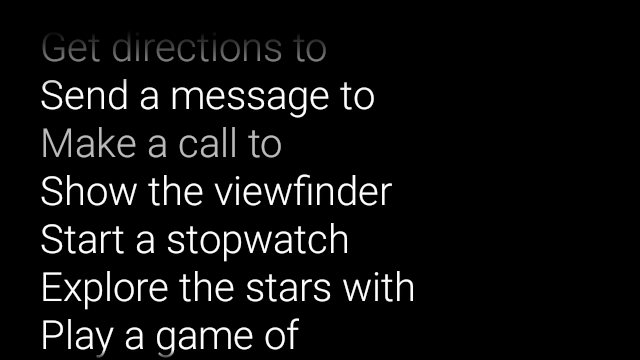
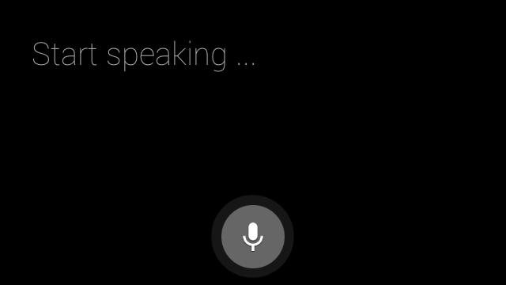

# Voice Input

Voice input lets you create a truly hands-free interface. Glass gives you three ways to utilize voice input.

Main voice commands start Glassware from the Home card, contextual voice commands can execute actions within an activity, and the system's speech recognition activity lets you receive free-form voice input from users.

## Main voice commands

These voice commands launch Glassware from the Home card (Clock card). When you declare a main voice command, Glass automatically creates a touch menu item as a fallback if users decide to start your Glassware with tapping on the Home card.




To add a voice command to the **ok glass** voice main menu:

1.  Create an XML resource for the voice command in `res/xml/<my_voice_trigger>.xml` that uses one of the existing voice commands defined in [`VoiceTriggers.Command`](https://developers.google.com/glass/develop/gdk/reference/com/google/android/glass/app/VoiceTriggers.Command) [**TODO**: ADD LINK]. For example, here's how to use "Start a run".

> **Note**: You can use [unlisted voice commands](https://developers.google.com/glass/develop/gdk/voice#unlisted_commands) [**TODO**: ADD LINK] for development purposes.

```xml
<?xml version="1.0" encoding="utf-8"?>
<trigger command="START_A_RUN" />
```

To create a voice command that prompts the user to speak an additional phrase before starting your activity or service, include an `input` element as well. For example, you might want to do this if you are using "Post an update".

```java
<?xml version="1.0" encoding="utf-8"?>
<trigger command="POST_AN_UPDATE">
    <input prompt="@string/glass_voice_prompt" />
</trigger>
```

2. Register an intent filter using the `com.google.android.glass.action.VOICE_TRIGGER` action in your Android manifest. The intent filter starts your activity or service if it detects users speaking your voice command.

```xml
<?xml version="1.0" encoding="utf-8"?><application ...>    <activity | service ...>        <intent-filter>            <action android:name=                    "com.google.android.glass.action.VOICE_TRIGGER" />        </intent-filter>        <meta-data android:name="com.google.android.glass.VoiceTrigger"            android:resource="@xml/my_voice_trigger" />    </activity | service>    // ...</application>
```

3. Declare an `android:icon` attribute for your activity or service. This allows Glass to display an icon for your Glassware in the **ok, glass** touch menu.

```xml
<activity |service    android:icon="@drawable/my_icon" ...>  ...</activity | service>
```

4. If your voice command uses a voice prompt and starts an activity, obtain any transcribed text with the following code (such as in [`onResume()`](http://developer.android.com/reference/android/app/Activity.html#onResume())):

```java
ArrayList<String> voiceResults = getIntent().getExtras()
        .getStringArrayList(RecognizerIntent.EXTRA_RESULTS);
```

If the voice command starts a service, the intent extra is available in the [`onStartCommand()`](http://developer.android.com/reference/android/app/Service.html#onStartCommand(android.content.Intent,%20int,%20int)) callback:

```java
@Override
public int onStartCommand(Intent intent, int flags, int startId) {
    ArrayList<String> voiceResults = intent.getExtras()
            .getStringArrayList(RecognizerIntent.EXTRA_RESULTS);
    // ...
}
```

### Setting constraints

If you need one or all of the following features to start your Glassware, specify them in the `res/xml/<my_voice_trigger>.xml` resource. If the features are not available, Glass disables the voice command:

-   `camera`
-   `network`
-   `microphone`

```xml
<trigger command="POST_AN_UPDATE">
    <constraints
        camera="true"
        network="true" />
</trigger>
```

## Contextual voice commands

Contextual voice commands allow users to carry out actions from activities. You build contextual voice commands with the standard Android menu APIs but users can invoke the menu items with voice commands instead of touch.

To enable contextual voice commands for a particular activity:

1.  Call `getWindow().requestFeature (`[`WindowUtils.FEATURE_VOICE_COMMANDS`](https://developers.google.com/glass/develop/gdk/reference/com/google/android/glass/view/WindowUtils#FEATURE_VOICE_COMMANDS)`)` in the desired activity to enable contextual voice commands. With this feature enabled, the **"ok glass"** menu appears in the footer area of the screen whenever this activity receives focus.
2.  Override [`onCreatePanelMenu()`](http://developer.android.com/reference/android/app/Activity.html#onCreatePanelMenu(int,%20android.view.Menu)) and handle the case where [`WindowUtils.FEATURE_VOICE_COMMANDS`](https://developers.google.com/glass/develop/gdk/reference/com/google/android/glass/view/WindowUtils#FEATURE_VOICE_COMMANDS) is enabled. If enabled, this is where you do one-time menu setup, like inflating a menu resource or calling the [`Menu.add()`](http://developer.android.com/reference/android/view/Menu.html#add(java.lang.CharSequence)) methods to create your voice menu system.
3.  Override [`onMenuItemSelected()`](http://developer.android.com/reference/android/view/Window.Callback.html#onMenuItemSelected(int,%20android.view.MenuItem)) to handle the voice commands when users speak them. When users are done selecting a menu item, the **"ok, glass"** voice command automatically reappears in the footer section of the screen, ready to accept a new voice command, as long as the activity remains in focus. The following code enables contextual voice commands, inflates a menu resource when appropriate, and handles voice commands when they are spoken:

```java
public class ContextualMenuActivity extends Activity {

    @Override
    protected void onCreate(Bundle bundle) {
        super.onCreate(bundle);

        // Requests a voice menu on this activity. As for any other
        // window feature, be sure to request this before
        // setContentView() is called
        getWindow().requestFeature(WindowUtils.FEATURE_VOICE_COMMANDS);
        setContentView(R.layout.activity_main);
    }

    @Override
    public boolean onCreatePanelMenu(int featureId, Menu menu) {
        if (featureId == WindowUtils.FEATURE_VOICE_COMMANDS) {
            getMenuInflater().inflate(R.menu.main, menu);
            return true;
        }
        // Pass through to super to setup touch menu.
        return super.onCreatePanelMenu(featureId, menu);
    }

    @Override
    public boolean onCreateOptionsMenu(Menu menu) {
        getMenuInflater().inflate(R.menu.main, menu);
        return true;
    }

    @Override
    public boolean onMenuItemSelected(int featureId, MenuItem item) {
        if (featureId == WindowUtils.FEATURE_VOICE_COMMANDS) {
            switch (item.getItemId()) {
                case R.id.dogs_menu_item:
                    // handle top-level dogs menu item
                    break;
                case R.id.cats_menu_item:
                    // handle top-level cats menu item
                    break;
                case R.id.lab_menu_item:
                    // handle second-level labrador menu item
                    break;
                case R.id.golden_menu_item:
                    // handle second-level golden menu item
                    break;
                case R.id.calico_menu_item:
                    // handle second-level calico menu item
                    break;
                case R.id.cheshire_menu_item:
                    // handle second-level cheshire menu item
                    break;
                default:
                    return true;
            }
            return true;
        }
        // Good practice to pass through to super if not handled
        return super.onMenuItemSelected(featureId, item);
    }
}
```

Here's an example of the menu resource used by the previous activity. Notice how you can create nested menu items for a hierarchical voice menu system. In the following example, the first menu item can be accessed as: **ok glass, Show me dogs, Labrador**.

```xml
<menu xmlns:android="http://schemas.android.com/apk/res/android">
    <!-- Use the constants defined in the ContextualMenus.Command enum-->
    <item
        android:id="@+id/dogs_menu_item"
        android:title="@string/show_me_dogs">
        <menu>
            <item
                android:id="@+id/lab_menu_item"
                android:title="@string/labrador" />
            <item
                android:id="@+id/golden_menu_item"
                android:title="@string/golden" />
        </menu>
    </item>
    <item
        android:id="@+id/cats_menu_item"
        android:title="@string/show_me_cats">
        <menu>
            <item
                android:id="@+id/cheshire_menu_item"
                android:title="@string/cheshire" />
            <item
                android:id="@+id/calico_menu_item"
                android:title="@string/calico" />
        </menu>
    </item>
</menu>
```

> **Note**: The menu titles in the previous menu resource use custom strings, which you can do if you specify the [development permission.](https://developers.google.com/glass/develop/gdk/voice#unlisted_commands) [**TODO**: ADD LINK] In your Glassware, use the values in the [`ContextualMenus.Command`](https://developers.google.com/glass/develop/gdk/reference/com/google/android/glass/app/ContextualMenus.Command) [**TODO**: ADD LINK] enum. For example, to use the [`PLAY_MUSIC`](https://developers.google.com/glass/develop/gdk/reference/com/google/android/glass/app/ContextualMenus.Command#PLAY_MUSIC) [**TODO**: ADD LINK] and [`PAUSE_MUSIC`](https://developers.google.com/glass/develop/gdk/reference/com/google/android/glass/app/ContextualMenus.Command#PAUSE_MUSIC) [**TODO**: ADD LINK] commands, you can create the following menu resource:

```xml
<menu xmlns:android="http://schemas.android.com/apk/res/android">    <!-- Use the constants defined in the ContextualMenus.Command enum-->    <item        android:id="@+id/play_menu_item"        android:title="PLAY_MUSIC" />    <item        android:id="@+id/pause_menu_item"        android:title="PAUSE_MUSIC" /></menu>
```

4. (Optional) Override [`onPreparePanel()`](http://developer.android.com/reference/android/view/Window.Callback.html#onPreparePanel(int,%20android.view.View,%20android.view.Menu)), checking whether or not [`WindowUtils.FEATURE_VOICE_COMMANDS`](https://developers.google.com/glass/develop/gdk/reference/com/google/android/glass/view/WindowUtils#FEATURE_VOICE_COMMANDS) is enabled. If enabled, this is where you can do other logic to set up the menu system, such as adding and removing certain menu items based on some criteria. You can also toggle contextual voice menus on (return `true`) and off (return `false`) based on some criteria. For example:

```java
    private boolean mVoiceMenuEnabled;
    ...
    @Override
    public boolean onPreparePanel(int featureId, View view, Menu menu) {
        if (featureId == WindowUtils.FEATURE_VOICE_COMMANDS) {
        // toggle this boolean on and off based on some criteria
            return mVoiceMenuEnabled;
        }
        // Good practice to call through to super for other cases
        return super.onPreparePanel(featureId, view, menu);
    }
```

### Supporting voice and touch menus simultaneously

Because contextual voice commands use the existing Android menu APIs, you can reuse a lot of the code and resources you already have for touch menus and simultaneously support both types of menus.

All you need to do is check for the `Window.FEATURE_OPTIONS_PANEL` feature in addition to the [`WindowUtils.FEATURE_VOICE_COMMANDS`](https://developers.google.com/glass/develop/gdk/reference/com/google/android/glass/view/WindowUtils#FEATURE_VOICE_COMMANDS) feature that you already are checking for in a few methods and then add in logic to open the touch menu on some user action, such as a tap.

For example, you can change the previous activity example to add support for touch menus like this (changes are commented):

```java
// 1. Check for Window.FEATURE_OPTIONS_PANEL
// to inflate the same menu resource for touch menus.
@Override
public boolean onCreatePanelMenu(int featureId, Menu menu) {
    if (featureId == WindowUtils.FEATURE_VOICE_COMMANDS ||
            featureId == Window.FEATURE_OPTIONS_PANEL) {
    ...
}

// 2. Check for Window.FEATURE_OPTIONS_PANEL
// to handle touch menu item selections.
@Override
public boolean onMenuItemSelected(int featureId, MenuItem item) {
    if (featureId == WindowUtils.FEATURE_VOICE_COMMANDS ||
            featureId == Window.FEATURE_OPTIONS_PANEL) {
    ...
}
```

With these changes, you can either tap or say **ok glass** to display your menu.

## Using unlisted voice commands for development

When you want to distribute your Glassware, you must use the approved main voice commands in [`VoiceTriggers.Command`](https://developers.google.com/glass/develop/gdk/reference/com/google/android/glass/app/VoiceTriggers.Command) and approved contextual voice commands in [`ContextualMenus.Command`](https://developers.google.com/glass/develop/gdk/reference/com/google/android/glass/app/ContextualMenus.Command).

If you want to use voice commands that are not available in the GDK, you can request an Android permission in your `AndroidManifest.xml` file:

```xml
<uses-permission
     android:name="com.google.android.glass.permission.DEVELOPMENT" />
```

> **Note**: This feature is for development purposes only.

### Using unlisted main voice commands

1.  Declare a string value in `res/values/strings.xml` that defines the name of your voice trigger. Optionally declare a voice prompt to display the speech recognition Glassware before starting your Glassware.

```xml
<?xml version="1.0" encoding="utf-8"?>
<resources>
    <string name="glass_voice_trigger">read me a story</string>
    <string name="glass_voice_prompt">what story?</string>
</resources>
```

2. Create an XML resource for the voice trigger in `res/xml/<my_voice_trigger>.xml`. For unlisted voice commands, you should use the `keyword` attribute instead of the `command` attribute used for approved voice commands. The `keyword` attribute should be a reference to the string resource defining the voice command. For a simple voice trigger that starts an activity or service immediately, simply specify the `trigger` element:

```xml
<?xml version="1.0" encoding="utf-8"?>
<trigger keyword="@string/glass_voice_trigger" />
```

To create a voice trigger that prompts the user to speak an additional phrase before starting your activity or service, include an input element as well:

```xml
<?xml version="1.0" encoding="utf-8"?>
<trigger keyword="@string/glass_voice_trigger">
    <input prompt="@string/glass_voice_prompt" />
</trigger>
```

### Using unlisted contextual voice commands

When creating menu items, use any text for the title of the menu item. For example:

```xml
<menu xmlns:android="http://schemas.android.com/apk/res/android">
    <!-- Use the constants defined in the ContextualMenus.Command enum-->
    <item
        android:id="@+id/pizza_menu_item"
        android:title="@string/find_pizza" />
</menu>
```

## Starting speech recognition



The speech recognition Glassware waits for users to speak and returns the transcribed text after they are done. To start the activity:

1.  Call [`startActivityForResult()`](http://developer.android.com/reference/android/app/Activity.html#startActivityForResult(android.content.Intent,%20int)) with the [`ACTION_RECOGNIZE_SPEECH`](http://developer.android.com/reference/android/speech/RecognizerIntent.html#ACTION_RECOGNIZE_SPEECH) intent. The following intent extras are supported when starting the activity:
    -   [`EXTRA_PROMPT`](http://developer.android.com/reference/android/speech/RecognizerIntent.html#EXTRA_PROMPT)
    -   [`EXTRA_RESULTS_PENDINGINTENT`](http://developer.android.com/reference/android/speech/RecognizerIntent.html#EXTRA_RESULTS_PENDINGINTENT)
    -   [`EXTRA_RESULTS_PENDINGINTENT_BUNDLE`](http://developer.android.com/reference/android/speech/RecognizerIntent.html#EXTRA_RESULTS_PENDINGINTENT_BUNDLE)
2.  Override the [`onActivityResult()`](http://developer.android.com/reference/android/app/Activity.html#onActivityResult(int,%20int,%20android.content.Intent)) callback to receive the transcribed text from the [`EXTRA_RESULTS`](http://developer.android.com/reference/android/speech/RecognizerIntent.html#EXTRA_RESULTS) intent extra. This callback is called when users finish speaking.

```java
private static final int SPEECH_REQUEST = 0;

private void displaySpeechRecognizer() {
    Intent intent = new Intent(RecognizerIntent.ACTION_RECOGNIZE_SPEECH);
    startActivityForResult(intent, SPEECH_REQUEST);
}

@Override
protected void onActivityResult(int requestCode, int resultCode,
        Intent data) {
    if (requestCode == SPEECH_REQUEST && resultCode == RESULT_OK) {
        List<String> results = data.getStringArrayListExtra(
                RecognizerIntent.EXTRA_RESULTS);
        String spokenText = results.get(0);
        // Do something with spokenText.
    }
    super.onActivityResult(requestCode, resultCode, data);
}
```

---

Portions of this page are reproduced from work created and [shared by Google](https://developers.google.com/readme/policies) and used according to terms described in the [Creative Commons 4.0 Attribution License](https://creativecommons.org/licenses/by/4.0/).
